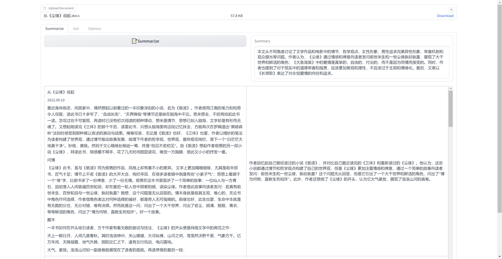

# GPT-Book Reader

GPT-Book Reader is a powerful app that enables reading, summarizing, and translating long texts using the cutting-edge GPT technology. It leverages the vectorstore approach provided in LangChain Index to deliver an enhanced user experience and improve support for Chinese content.

## Features
- Content-Based Answer Retrieval: Efficiently find relevant answers and information from within long texts.
- Long Text Summarization: Generate concise summaries of lengthy documents to save your time and effort.
- Translation: Translate long texts to your preferred language with a single click.

## Getting Started
To get started with this project, you’ll need to install the required packages. You can do this by following these steps:

1. Make sure you have `pip` installed. If you don’t have it installed, you can follow the instructions [here](https://pip.pypa.io/en/stable/installing/) to install it.
2. Install the required packages by running the command `pip install -r requirements.txt`.
3. Once you have installed the required packages, you can launch the web UI by running the command `python webui.py`.

## Customization
GPT-Book Reader offers a high degree of customization by allowing users to modify the prompt templates in LangChain, catering to their specific needs and language preferences.

## Demo

<!-- ## Contributing
[placeholder for contribution guidelines, code of conduct, and any prerequisites for contributing]

## License
[placeholder for license information] -->

## Acknowledgements
Special thanks to:
- [LangChain](https://www.google.com/url?sa=t&rct=j&q=&esrc=s&source=web&cd=&cad=rja&uact=8&ved=2ahUKEwia5JWh2Y7-AhXJE1kFHVb6CUcQFnoECAkQAQ&url=https%3A%2F%2Fgithub.com%2Fhwchase17%2Flangchain&usg=AOvVaw26LgcZwVuJ9OH5WXz_W6lv) for providing the vectorstore & chain approachs, which made the development of GPT-Book Reader possible.
- [Gradio](https://gradio.app/) for their user-friendly and flexible library, which enabled the creation of an interactive and visually appealing user interface.

Enjoy reading and summarizing long texts effortlessly with GPT-Book Reader! If you find this project useful, please consider giving it a ⭐ on GitHub!